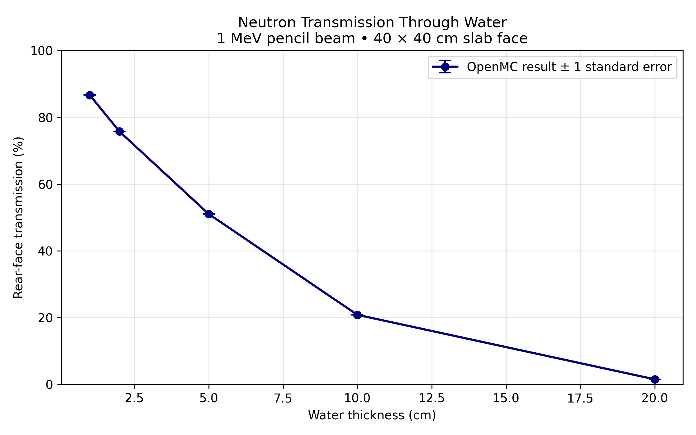
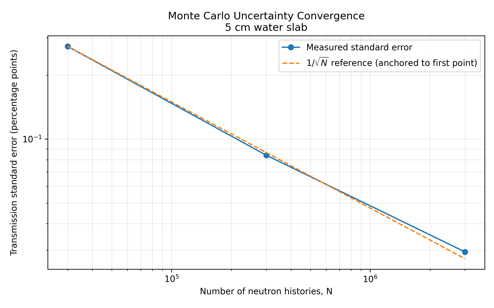

# Neutron Transmission Through Water Using OpenMC

A Python-driven Monte Carlo study of neutron transmission through water, including automated thickness sweeps, a vacuum verification case, and statistical convergence analysis.

## Research Question

How does water thickness affect the fraction of incident 1 MeV neutrons exiting the rear face of a finite slab, and how does simulation size affect the uncertainty of that estimate?

## Results

Rear-face transmission decreased from approximately **87% at 1 cm** to **2% at 20 cm**. Each thickness case used 300,000 neutron histories. These endpoint values are approximate readings from the plot; the CSV tables contain the numerical results.

For the 5 cm slab, the convergence study produced:

| Neutron histories | Transmission | Standard error (percentage points) |
| ---: | ---: | ---: |
| 30,000 | 50.960% | 0.273 |
| 300,000 | 51.027% | 0.084 |
| 3,000,000 | 51.020% | 0.029 |

Transmission remained consistent while its standard error decreased approximately as `1/sqrt(N)`.

The vacuum verification case reproduced **100% transmission**, as expected for the directed beam with the water removed. The main notebook also completed a fresh-kernel run without errors.

## Model

| Parameter | Specification |
| --- | --- |
| Code | OpenMC 0.15.3 |
| Calculation | Fixed-source neutron transport |
| Source | 1 MeV pencil beam directed along +x |
| Slab face | 40 × 40 cm |
| Water thicknesses | 1, 2, 5, 10, and 20 cm |
| Water composition | H1 and O16 in a 2:1 atomic ratio |
| Density | 0.997 g/cm³ |
| Temperature | 293.6 K |
| Exterior boundaries | Vacuum |
| Nuclear data | Official OpenMC ENDF/B-VII.1 processed library |
| Thermal scattering | Hydrogen bound in water (`c_H_in_H2O`) |

A rear-face surface-current tally measures transmission per source neutron. At this vacuum boundary, crossings are outward only. Transmission includes both uncollided neutrons and neutrons that scattered before exiting.

## Project Files

- **Main simulation notebook (`.ipynb`):** model definition, baseline simulation, vacuum verification, thickness sweep, convergence study, and conclusions.
- **[prepare_nuclear_data.ipynb](prepare_nuclear_data.ipynb):** nuclear-data download, extraction, and index generation.
- **[report.pdf](report.pdf):** project report.
- **[figures/](figures/):** transmission and convergence plots.
- **[results/transmission_results.csv](results/transmission_results.csv):** thickness-study results.
- **[results/convergence_results.csv](results/convergence_results.csv):** statistical convergence results.

## Reproducing the Study

### Requirements

Use an environment containing the OpenMC executable and its Python API, along with JupyterLab, NumPy, and Matplotlib. The study was run using OpenMC 0.15.3 in a Docker-based environment. Installing only the Python API is insufficient to run transport calculations.

See the [OpenMC installation guide](https://docs.openmc.org/en/stable/quickinstall.html) for environment setup. An environment lockfile or pinned container digest is not included, so identical dependency versions are not guaranteed.

### Run order

1. Place both notebooks in the project root and launch JupyterLab with that folder as the working directory.
2. Run `prepare_nuclear_data.ipynb` from top to bottom. It downloads a large official ENDF/B-VII.1 archive, extracts H1, O16, and water thermal-scattering data, and creates `nuclear_data/water_endfb71/cross_sections.xml`.
3. Open the main simulation notebook and run its cells in order. Its setup cell points to that data index.
4. Confirm that the vacuum verification reports `PASS`.
5. Review the thickness and convergence results. New simulation files, CSV tables, and figures are saved in timestamped directories under `runs/`.

The published `figures/` and `results/` folders contain selected outputs. Rerunning the notebooks creates new outputs under `runs/`; it does not automatically replace those published copies.

Nuclear-data files, the downloaded archive, and raw simulation outputs are not intended for inclusion in the repository. Prepare the data locally using the setup notebook.

## Verification and Limitations

- The vacuum case checks the directed source, geometry, and transmission tally; it does not validate water interaction physics against experiment.
- The convergence study measures sampling behavior. A small standard error does not establish physical accuracy.
- The source is an idealized monoenergetic pencil beam.
- The slab is finite, allowing escape through its front and sides.
- Absorption and leakage through other faces were not tallied separately. Missing transmission cannot be interpreted as absorption alone.
- Reported uncertainties represent Monte Carlo sampling only. Nuclear-data and modeling uncertainties were not quantified.
- No experimental benchmark or independent-code comparison was performed.
- Transmission is not radiation dose, and these results are not a facility shielding assessment.

## Future Work

- Tally absorption and leakage through all exterior faces to check neutron balance.
- Measure the energy spectrum of transmitted neutrons.
- Compare the model against a suitable published benchmark.

## Skills Demonstrated

Python scripting, OpenMC material and geometry modeling, Monte Carlo transport, automated parameter studies, statistical uncertainty analysis, numerical verification, and scientific visualization.

## References

- [OpenMC documentation](https://docs.openmc.org/en/stable/)
- [Official nuclear-data libraries](https://openmc.org/data/)
- [Tallies and normalization](https://docs.openmc.org/en/stable/usersguide/tallies.html)
